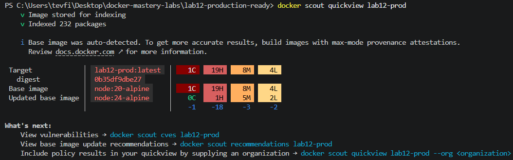
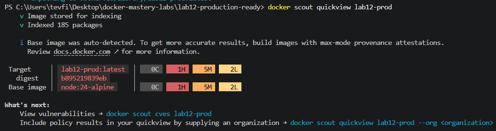

# Lab 12 — Production-Ready Docker Setup

## Goal

Bring together everything from the previous 11 labs and add the final layer of production practices: a non-root user, a built-in health check, a restart policy, resource limits, and a real vulnerability scan — including a debugging session where the health check itself exposed a real application bug.

## What I did

### Part 1 — Non-root user

Updated the Dockerfile (building on the Lab 10 multi-stage pattern):
```dockerfile
RUN addgroup -S appgroup && adduser -S appuser -G appgroup
...
USER appuser
```
Verified inside the running container:
```
docker exec lab12-test whoami
# → appuser
```
Running as a non-root user limits the blast radius if the application is ever compromised — a standard production expectation, since containers run as root by default otherwise.

### Part 2 — Health check, and a real bug it caught

Added a `HEALTHCHECK` directly in the Dockerfile (rather than only in Compose, as in Lab 07), so it travels with the image regardless of how it's run:
```dockerfile
HEALTHCHECK --interval=30s --timeout=5s --start-period=10s --retries=3 \
  CMD wget --no-verbose --tries=1 --spider http://127.0.0.1:3000/health || exit 1
```

**This surfaced a real bug.** The container kept reporting `(unhealthy)`. Debugging process:
1. `docker inspect lab12-test --format='{{json .State.Health}}'` showed the healthcheck itself was timing out connecting to the app.
2. Ruled out an IPv6/`localhost` ambiguity by switching the check to `127.0.0.1` explicitly — no change.
3. `docker exec` into the container and ran `wget` manually — it hung indefinitely, never completing or erroring.
4. `netstat -tlnp` inside the container confirmed Node *was* listening on port 3000 — so the process wasn't down, something else was wrong.
5. Traced it to the application code: `client.connect()` to PostgreSQL was failing (no real `db` host in this standalone test), but the request handler still called `await client.query(...)` on the unconnected client. Instead of rejecting immediately, this left every incoming HTTP request — including the health check's request — hanging forever.

**Fix**: added a dedicated `/health` endpoint that responds without touching the database at all, and a `dbConnected` flag so the main route fails fast (`503`) instead of hanging when the database isn't reachable:
```javascript
let dbConnected = false;

client.connect()
  .then(() => { dbConnected = true; })
  .catch(err => console.error('Database connection error:', err.message));

const server = http.createServer(async (req, res) => {
  if (req.url === '/health') {
    res.writeHead(200, { 'Content-Type': 'text/plain' });
    res.end('OK\n');
    return;
  }
  if (!dbConnected) {
    res.writeHead(503, { 'Content-Type': 'text/plain' });
    res.end('Database not connected\n');
    return;
  }
  // ... existing query logic
});
```
After this fix, the container reported `(healthy)` within 6 seconds.

### Part 3 — Restart policy

```
docker run -d --name lab12-test --restart unless-stopped ... lab12-prod
```
`unless-stopped` automatically restarts the container if it crashes, but won't restart it if it was manually stopped — different from `always`, which would restart it even after a manual stop following a daemon restart.

### Part 4 — Resource limits

```
docker run -d --name lab12-test --restart unless-stopped --memory=128m --cpus=0.5 ... lab12-prod
docker stats --no-stream lab12-test
```
Confirmed the limit was actually enforced: `MEM USAGE / LIMIT` showed `13.15MiB / 128MiB` — the container only sees its allotted 128MB ceiling, not the host's full memory. Prevents a single misbehaving container from starving the rest of the system.

### Part 5 — Vulnerability scanning with Docker Scout, and a base image upgrade

Initial scan on `node:20-alpine`:



**1 Critical, 19 High, 8 Medium, 4 Low** vulnerabilities across 232 packages. Docker Scout recommended updating the base image to `node:24-alpine`.

Updated **both** `FROM` lines in the multi-stage Dockerfile (the build stage *and* the final runtime stage — only updating the first one has no effect on the final image, since the last `FROM` is what the shipped image is actually based on) and rescanned:



**0 Critical, 1 High, 5 Medium, 2 Low** across 185 packages — critical vulnerabilities eliminated entirely, high-severity count dropped from 19 to 1, just from a base image version bump. Re-verified the app still worked correctly afterward (`(healthy)` in 6 seconds, `whoami` still `appuser`) — the upgrade didn't break anything.

### Cleanup
```
docker stop lab12-test
docker rm lab12-test
```

## Key concepts

- **Multi-stage builds have multiple `FROM` lines, and only the last one matters for the shipped image.** Updating the `builder` stage's base image without updating the final stage's has zero effect on the actual vulnerability surface — a mistake made and caught during this lab.
- **A health check should test the application's actual readiness with minimal dependencies of its own.** Routing the check through a path that depends on an unrelated service (the database) means an outage in that dependency can falsely — or, as seen here, *genuinely* — block the entire health signal due to a hanging request, not just a slow one.
- **`await` on a query against a client that never finished connecting can hang indefinitely** rather than throwing — silent, until something times out waiting on it. This is the kind of bug that's easy to miss in local development (where the DB is usually up) and easy to catch via a health check probing real behavior.
- **`--restart unless-stopped` vs `--restart always`**: both recover from crashes, but `unless-stopped` respects an explicit manual stop, while `always` will restart even after that, post-daemon-restart.
- **Resource limits (`--memory`, `--cpus`) are enforced by the kernel**, not just advisory — confirmed directly via `docker stats`.
- **Smaller, more current base images reduce vulnerability count significantly.** This isn't just theoretical — going from `node:20-alpine` to `node:24-alpine` cut total tracked packages from 232 to 185 and eliminated all critical-severity findings, with no code changes.

## Commands reference

| Command | Purpose |
|---|---|
| `docker exec <container> whoami` | Confirm which user a container's process is running as |
| `docker inspect <container> --format='{{json .State.Health}}'` | Full healthcheck history and failure output |
| `docker run --restart unless-stopped ...` | Auto-restart on crash, but not after a manual stop |
| `docker run --memory=<limit> --cpus=<limit> ...` | Enforce hard resource ceilings on a container |
| `docker stats --no-stream <container>` | Snapshot resource usage against configured limits |
| `docker scout quickview <image>` | Vulnerability summary (Critical/High/Medium/Low) for an image |

## Notes

This lab is the closest simulation in the series to an actual production incident: a healthcheck failing for a non-obvious reason, requiring systematic debugging (logs → inspect → manual reproduction → root cause in application code) rather than a one-line fix. Combined with Lab 11's CI/CD pipeline, this image is now ready to be the basis for the final project's backend service.
